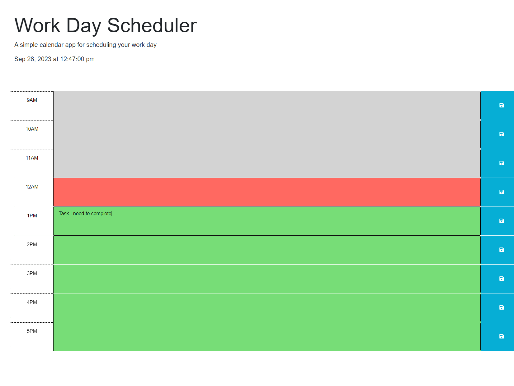
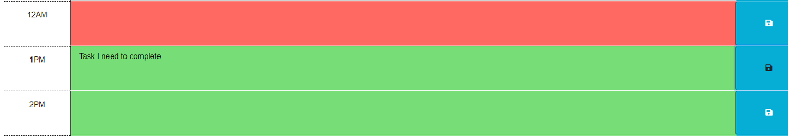

# work-day-scheduler

## Description
A dynamically updated work day scheduler which can have tasks written for certain hours, and also displays which tasks are ahead/behind you.

## Usage

The application utilizes localStorage to save your tasks throughout the day, to add a task:

Type your task into the alloted time period: 

And then click the Save button:

## Installation

This application should run perfectly in any modern browser.

## Credits
Stackoverflow: 
https://stackoverflow.com/questions/22166708/using-a-function-with-an-interval-to-change-a-class-of-a-div

Repo Link: https://github.com/fspaghetti3/work-day-scheduler

Application Link: https://fspaghetti3.github.io/work-day-scheduler/